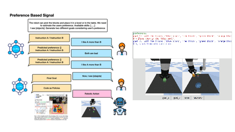
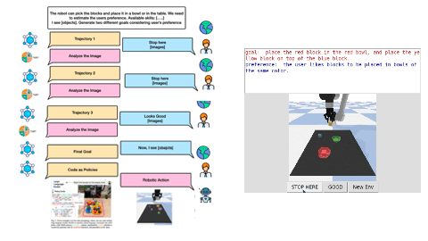
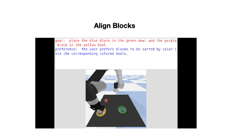
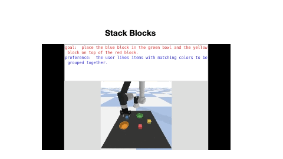
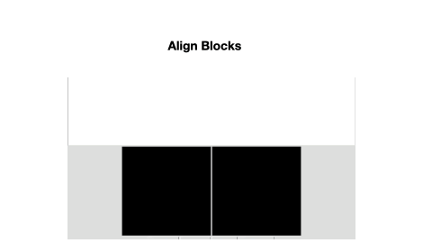
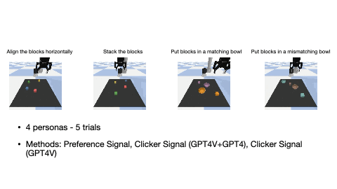
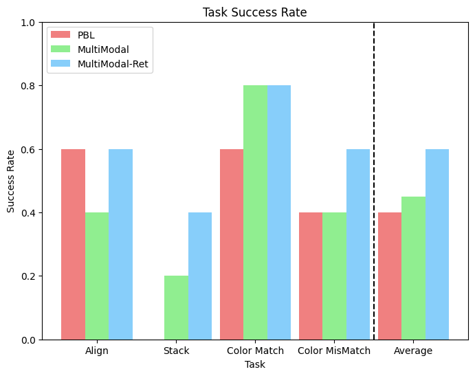

# Active Learner LLM
In this repository, we explore the capability of LLM to reason out the user's intention based on the sparse signals. 


## Overview
1. Clicker Signal



2. Preference Signal



## Run the Code
### Install

```
pip install numpy scipy shapely astunparse pygments openai
pip install imageio==2.4.1 imageio-ffmpeg pybullet moviepy
pip install tkinter
pip install gdown
```

Download assets
```
gdown --id 1Cc_fDSBL6QiDvNT4dpfAEbhbALSVoWcc
gdown --id 1yOMEm-Zp_DL3nItG9RozPeJAmeOldekX
gdown --id 1GsqNLhEl9dd4Mc3BM0dX3MibOI1FVWNM
unzip ur5e.zip
unzip robotiq_2f_85.zip
unzip bowl.zip
mkdir temp
```


### Run
```
# run clicker signal
python multimodal.py

# run preference signal
python pbl.py
```

## Results
### Demonstrations
1. Align the blocks - Clicker Signal



2. Stack the blocks - Clicker Signal



3. Align the blocks - Preference Signal



### Experiments
- Settings



- Results

